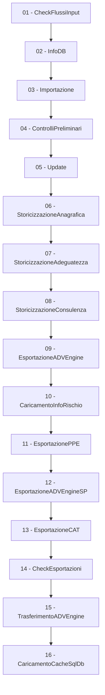

# POC_GEN_AI — Data Integration

## Ordine Esecuzione Batch (da batchTotale.sh)

### Ambito Applicativo 1 (principale)

| # | Batch XML | Job Name | Tipo |
|---|-----------|----------|------|
| 01 | [batchCheckFlussiInput.xml](batch/01-batchCheckFlussiInput.md) | FASE CHECK FLUSSI INPUT | Java |
| 02 | [batchInfoDB.xml](batch/02-batchInfoDB.md) | InfoDB | Java |
| 03 | [batchImportazione.xml](batch/03-batchImportazione.md) | FASE IMPORTAZIONE FLUSSI DI INPUT | SQL+Java (multithread) |
| 04 | [batchControlliPreliminari.xml](batch/04-batchControlliPreliminari.md) | CONTROLLI PRELIMINARI | SQL |
| 05 | [batchUpdate.xml](batch/05-batchUpdate.md) | UPDATE | SQL (MERGE) |
| 06 | [batchStoricizzazioneAnagrafica.xml](batch/06-batchStoricizzazioneAnagrafica.md) | STORICIZZAZIONE ANAGRAFICA | SQL |
| 07 | [batchStoricizzazioneAdeguatezza.xml](batch/07-batchStoricizzazioneAdeguatezza.md) | STORICIZZAZIONE ADEGUATEZZA | SQL |
| 08 | [batchStoricizzazioneConsulenza.xml](batch/08-batchStoricizzazioneConsulenza.md) | STORICIZZAZIONE CONSULENZA | SQL |
| 09 | [batchEsportazioneADVEngine.xml](batch/09-batchEsportazioneADVEngine.md) | ESPORTAZIONE ADV ENGINE | SQL+Java+Export |
| 10 | [batchCaricamentoInfoRischio.xml](batch/10-batchCaricamentoInfoRischio.md) | Caricamento Info Rischio | Java+SQL |
| 11 | [batchEsportazionePPE.xml](batch/11-batchEsportazionePPE.md) | ESPORTAZIONE PPE | SQL+Java |
| 12 | [batchEsportazioneADVEngineSP.xml](batch/12-batchEsportazioneADVEngineSP.md) | ESPORTAZIONE ADV ENGINE SP | SQL+Java |
| 13 | [batchEsportazioneCAT.xml](batch/13-batchEsportazioneCAT.md) | ESPORTAZIONE CATALOGO | SQL |
| 14 | [batchCheckEsportazioni.xml](batch/14-batchCheckEsportazioni.md) | CHECK ESPORTAZIONI | Java |
| 15 | [batchTrasferimentoADVEngine.xml](batch/15-batchTrasferimentoADVEngine.md) | TRASFERIMENTO ADV ENGINE | FileSystem |
| 16 | [batchCaricamentoCacheSqlDb.xml](batch/16-batchCaricamentoCacheSqlDb.md) | CARICAMENTO CACHE SQL DB | Java |

### Ambito Applicativo 2 (secondario)

| # | Batch XML | Job Name | Tipo |
|---|-----------|----------|------|
| 17 | [batchAllineamentoGiornaliero.xml](batch/17-batchAllineamentoGiornaliero.md) | ALLINEAMENTO GIORNALIERO | SQL |
| 08b | [batchStoricizzazioneConsulenza.xml](batch/08-batchStoricizzazioneConsulenza.md) | STORICIZZAZIONE CONSULENZA (AA=2) | SQL |

### Batch on-demand (non in batchTotale)

| # | Batch XML | Job Name | Tipo |
|---|-----------|----------|------|
| 18 | [batchCaricamentoCacheRedis.xml](batch/18-batchCaricamentoCacheRedis.md) | CARICAMENTO CACHE REDIS | Java |
| 19 | [batchCaricamentoCacheDynamoDB.xml](batch/19-batchCaricamentoCacheDynamoDB.md) | CARICAMENTO CACHE DYNAMODB | Java |
| 20 | [batchPubblicaModificheACaldo.xml](batch/20-batchPubblicaModificheACaldo.md) | PUBBLICA MODIFICHE A CALDO | Java |

## Diagramma Flusso (AA=1)

## Tracciati Input

Vedi [tracciati-input.md](tracciati-input.md) per il dettaglio completo dei formati file CSV/TXT.

## Note Architetturali

- **AWS S3 Sync:** i file di input vengono scaricati da S3 prima dell'esecuzione (`s3sync.sh IN`) e i file di output caricati alla fine (`s3sync.sh OUT`)
- **Flyway:** migrazione database automatica (predisposta, attualmente commentata)
- **Importazione multithread:** i 3 flussi più voluminosi (mappatura, anagrtit, catalogotm) vengono importati in parallelo
